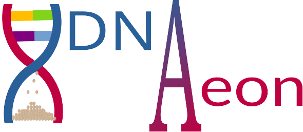

<p align="center">
  
</p>

DNA-Aeon is a codec for the storage of digital data into constraint adhering DNA sequences with the ability to detect and correct insertions, deletions, substitutions and loss of fragments.
The inner encoder uses the concept of arithmetic coding to generate constraint-adhering DNA sequences, with periodical inserted CRCs functioning as marker symbols.
These marker symbols are used by the inner decoder, which is a variant of the stack algorithm, to stay in sync and allowing the correction of insertions, deletions and substitutions.

As outer code the raptor-fountain implementation of [NOREC4DNA](https://github.com/umr-ds/NOREC4DNA.git) is used, which can generate an arbitrary amount of redundant packages. This enables DNA-Aeon to account for the 
loss of complete fragments and the successful decoding of the input data even if the inner decoder should fail.

# Installation
To download DNA-Aeon, clone the repository to a folder of your choice with the **--recurse-submodules** command:

```shell
$ git clone https://github.com/MW55/DNA-Aeon --recurse-submodules
```

you can then start the installation using the *setup.py* script in the root folder of the cloned repository:

```shell
$ python3 setup.py
```

this will create a python virtual environment in the NOREC4DNA folder, install NOREC4DNA and then compile DNA-Aeon.

# Usage
## Code Book Generation
DNA-Aeon uses a code book of allowed sequences, together with a concatenation scheme, to adhere to user-defined constraints.
These files are used to generate a model for the underlying arithmetic code. Besides encoding data to a constraint-adhering DNA representation, the
model also allows the decoder to leverage the knowledge regarding positional base-probabilities to detect and correct errors. 

A code book is just a FASTA file containing all allowed sequences of a given length (a common length would be 10 bp), while the concatenation scheme is a
json file that contains key, value pairs of codeword prefixes and suffixes that are not allowed to be concatenated, i.e. if a key is the suffix of
the last code word used for encoding, all code words containing the corresponding value can not be used as next code words.

An example concatenation scheme, here for code words where homopolymers of length 4 or more are disallowed, is shown below:
```json
{
   "motif":{
      "A":[
         "AAA"
      ],
      "AA":[
         "AA"
      ],
      "AAA":[
         "A"
      ],
      "G":[
         "GGG"
      ],
      "GG":[
         "GG"
      ],
      "GGG":[
         "G"
      ],
      "T":[
         "TTT"
      ],
      "TT":[
         "TT"
      ],
      "TTT":[
         "T"
      ],
      "C":[
         "CCC"
      ],
      "CC":[
         "CC"
      ],
      "CCC":[
         "C"
      ]
   }
}
```
As long as the code words are in FASTA format and the concatenation scheme has the structure as shown above, DNA-Aeon supports any
code book. For typical DNA data storage applications, we included the code book generation tool [ConstrainedKaos](https://github.com/HFLoechel/ConstrainedKaos) and a python wrapper to 
generate code books with ConstrainedKaos, together with the corresponding concatenation scheme. ConstrainedKaos supports limits on the homopolymer lengths, a fixed GC content or a GC content in a 
specific interval and undesired motifs, which can be supplied in a FASTA file.

To generate a code book and concatenation file using ConstraintKaos, the python wrapper file *generate_codebook.py* is used in the following way:

```shell
$ python3 generate_codebook.py --GClow 0.4 --GChigh 0.6 --homopolymer 4 --Motifs </path/to/undesired_sequences.fasta> --Length 10 --Output </target/path/codebook.fasta>
```
This command will produce the codebook *codebook.fasta*, together with the concatenation scheme *codebook.json*. The codebook contains codewords of length 10 with a GC
content between 40 % and 60 %, no homopolymers of length 4 or longer and without any undesired subsequences / motifs as specified in *undesired_sequences.fasta*.
The paths to the codebook and concatenation scheme can then be added to the configuration file of the code to encode data using the code book.

In the codewords folder a codebook and concatenation scheme for the common hp < 4 and GC 40 % - 60 % constraints is already provided.
## Encoding
To encode data using DNA-Aeon, we provide the wrapper script *encode.py* and an example configuration file *config.json*:

```shell
$ python3 encode.py -c config.json
```

This will encode the data specified in the *config.json* file first using the NOREC4DNA raptor-fountain implementation, followed by 
encoding the data using the inner encoder of DNA-Aeon. The parameters of the config file are described in section [Configuration file](#Configuration-file).

## Decoding
To decode data, the same config file as for encoding is used, together with the wrapper script *decode.py*:

```shell
$ python3 decode.py -c config.json
```

This will decode the data specified in the config file and will save the decoded data under *data/results/*.


# Configuration file
```json
{
    "general": {
        "sync": 4, // [Required] Number of bytes between sync (crc) steps
        "as_fasta": false, // [Default: false] For Decoding: Input is a .fasta file; For Encoding: Output is a .fasta file. [If set, each sequence will be en-/decoded in a separate thread. For Encoding: Input MUST be a .zip file!]
        "codebook": {
            "words": "./codewords/codebook_test.fasta", // [Default: ./codewords/codebook_test.fasta] path to codewords
            "motifs": "./codewords/codebook_test.json" // [Default: ./codewords/codebook_test.json] path to motifs
        },
        "threads": 4, // [Default: max available] number of threads to use if input is zip or fasta
        "zip": {
            "most_common_only": true, // [IF ZIP, Default: true] save only the most common
            "decodable_only": true // [IF ZIP, Default: true] save only decodable (metric != 1000)
        }
    },
    "NOREC4DNA": {
      "chunk_size": 13, // Size of the chunks generated by the outer encoder, parameter to adjust the length of the DNA fragments
      "package_redundancy": 0.45 // Amount of redundant packages (DNA fragments) to be generated by the outer encoder, higher redundancy = better error correction.
    },
    "encode":{
        "input": "data/test.txt", // [Required IF ENCODE] input path
        "output": "data/encoded.txt", // [Required IF ENCODE] output path
        "min_length": 0, // [Default: 0] The minimal length the encoded file(s) should have [only used for encoding].
        "same_length": false, // [Default: false] If encoding a Zip file, encode all packets so that the have the same length.
        "update_config": true, // [Default: true] updates config ["decode"]["length"] with sequence length (only if not zip or same_length)
        "keep_intermediary": false // [Default: false] keep the intermediary output of the inner encoder.
    },
    "decode":{
        "input": "data/encoded.txt", // [Required IF DECODE] input path
        "output": "data/decoded.txt", // [Required IF DECODE] output path
        "NOREC4DNA_config": "data/encoded.ini", // Path to the NOREC4DNA config, is generated during encoding.
        "length": 0, // [Default (or if 0): input.size()] Length of the original message
        "threshold": {
            "loop": 1, //[Default: 1] For how many (additional) candidate sequences should be searched in each loop. (The best one is always checked)
            "finish": 0, // [Default: 0] For how many (additional) candidate sequences should be searched for before finishing. (The best one is always checked)
            "checkpoint": 3 //[Default: 3] CRCCheckpoint Threshold
        },
        "metric": {
            "fano": {
                "rate": {"low": 4, "high": 5}, //Default if missing sync and sync+1
                "error_probability": 0.05 // Default: 0.05 expected errorprobability
            },
            "penalties": {
                "crc": 0.1, // Default: 0.1 Penalty added if crc fails
                "no_hit": 8 // Default: 8 Dividend for penalty added if base is not expected Formula: candidate.size() / no_hit
            }
        },
        "queue": {
            "size": 200000, // Default 200000 Size of the queue to hold candidates
            "runs": 5, // Default: 5, Times the queue can be filled
            "reduce": 0.25 // Default: 0.25 To what percentage the queue should be reduced if its full.
        }
    }
}
```

## Usage (Docker):
DNA-Aeon can be run in inside a Docker container.

```bash 
# only needed if you want to build a new container from source:
docker build . --tag dna_aeon

# a public image we be soon under the mosla/dna_aeon:latest tag

# encoding:
docker run -v /tmp/data:/DNA_Aeon/data:z -v /tmp/codewords:/DNA_Aeon/codewords:z -it dna_aeon python3 encode.py --config data/config_test.json

# decoding:
docker run -v /tmp/data:/DNA_Aeon/data:z -v /tmp/codewords:/DNA_Aeon/codewords:z -it dna_aeon python3 decode.py --config data/config_test.json

```
###!! while "/tmp/data" will most likely work, make sure to set the correct paths for your volume mappings !!
All input files must be inside the /data folder.

All output files will be written to "/data/results".
